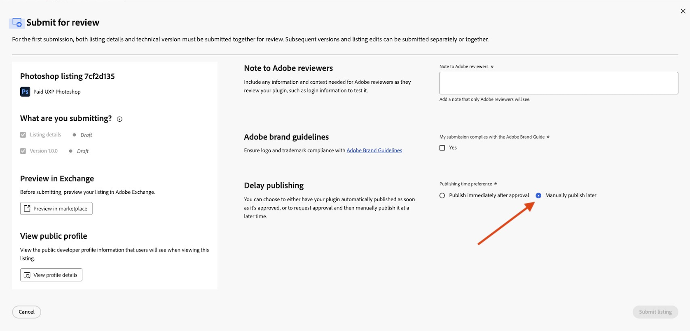
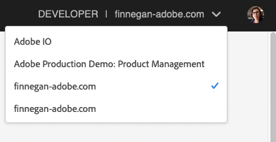

---
keywords:
  - Creative Cloud
  - Marketplace
  - Exchange
  - Distribution
  - Extensibility
  - SDK
  - Developer Tooling
  - UXP
  - Photoshop
  - XD
  - Plugin
  - JavaScript
  - Developer Console
  - Creative Cloud Desktop
  - FastSpring
  - DSA
  - Compliance
  - Trader Details
title: FAQ - Frequently Asked Questions
description: This is the FAQ page
---

# Frequently Asked Questions

This document provides answers to frequently asked questions about Adobe Developer Distribution. This is a great place to start when troubleshooting a problem with distributing your plugin.

## Questions

- [Frequently Asked Questions](#frequently-asked-questions)
  - [Questions](#questions)
  - [Answers](#answers)
    - [What is Developer Distribution?](#what-is-developer-distribution)
    - [Who can use Developer Distribution?](#who-can-use-developer-distribution)
    - [What happens to my existing listings in the Developer Console?](#what-happens-to-my-existing-listings-in-the-developer-console)
    - [I distribute templates/brush packs/textures/filters or other non-plugin items via the Exchange. Can I use Developer Distribution?](#i-distribute-templatesbrush-packstexturesfilters-or-other-non-plugin-items-via-the-exchange-can-i-use-developer-distribution)
    - [What’s new in Developer Distribution?](#whats-new-in-developer-distribution)
    - [What's the difference between the Creative Cloud desktop app Plugin Marketplace and Exchange Marketplace?](#whats-the-difference-between-the-creative-cloud-desktop-app-plugin-marketplace-and-exchange-marketplace)
    - [Do I need to fill in my profile details all over again?](#do-i-need-to-fill-in-my-profile-details-all-over-again)
    - [What is an Adobe ID?](#what-is-an-adobe-id)
    - [Should I log in with a personal Adobe ID or Corporate Adobe ID?](#should-i-log-in-with-a-personal-adobe-id-or-corporate-adobe-id)
    - [How do I retract, mark as pending, modify or re-publish my listing on Developer Distribution?](#how-do-i-retract-mark-as-pending-modify-or-re-publish-my-listing-on-developer-distribution)
    - [How do I set up an account with FastSpring to collect revenue for my first paid listing?](#how-do-i-set-up-an-account-with-fastspring-to-collect-revenue-for-my-first-paid-listing)
  - [How can I add an extra layer of security to my paid plugins?](#how-can-i-add-an-extra-layer-of-security-to-my-paid-plugins)
    - [What do I do when I get “Access Denied” upon login?](#what-do-i-do-when-i-get-access-denied-upon-login)
    - [I don't see my listings after logging in.](#i-dont-see-my-listings-after-logging-in)
    - [What is the revenue share for paid products?](#what-is-the-revenue-share-for-paid-products)
    - [What should I do to get support with development?](#what-should-i-do-to-get-support-with-development)
    - [How do Categories and Tags work?](#how-do-categories-and-tags-work)
      - [Categories:](#categories)
      - [Tags:](#tags)
    - [Do I need to use the Adobe Developer Console at all in the process of distributing my UXP plugin?](#do-i-need-to-use-the-adobe-developer-console-at-all-in-the-process-of-distributing-my-uxp-plugin)
    - [How can I fix a server error encountered while using the portal?](#how-can-i-fix-a-server-error-encountered-while-using-the-portal)
    - [When do I have to complete my public profile?](#when-do-i-have-to-complete-my-public-profile)
    - [How can I troubleshoot the following errors on package upload?](#how-can-i-troubleshoot-the-following-errors-on-package-upload)
        - [UXP Manifest Notes](#uxp-manifest-notes)
    - [I work exclusively offline, or in a setting where access to the internet is extremely limited. Can I use scripts, plugins, extensions, or C++ plugins? How can I install all of the above without the Creative Cloud desktop app, or while offline?](#i-work-exclusively-offline-or-in-a-setting-where-access-to-the-internet-is-extremely-limited-can-i-use-scripts-plugins-extensions-or-c-plugins-how-can-i-install-all-of-the-above-without-the-creative-cloud-desktop-app-or-while-offline)
    - [Why is my plugin not visible in the EU region?](#why-is-my-plugin-not-visible-in-the-eu-region)
    - [How can I update my trader details in the publisher profile after submission?](#how-can-i-update-my-trader-details-in-the-publisher-profile-after-submission)
    - [Can an EU user still use my plugin if they have already installed it, but I am not compliant with the DSA trader requirements?](#can-an-eu-user-still-use-my-plugin-if-they-have-already-installed-it-but-i-am-not-compliant-with-the-dsa-trader-requirements)
    - [I’m stuck! Can you help me?](#im-stuck-can-you-help-me)

## Answers

### What is Developer Distribution?

[Adobe Developer Distribution](https://developer.adobe.com/distribute/home) is a new portal for Creative Cloud developers who wish to distribute new and manage existing UXP and ZXP plugin in the Creative Cloud Marketplace. The Creative Cloud Marketplace can be found in both the **Stock & Marketplace** tab in the Creative Cloud desktop app, and on the web within [the Exchange Marketplace](https://exchange.adobe.com/apps/browse/cc?product=All&sort=MOST_POPULAR). The new Developer Distribution portal offers a powerful and flexible surface for developers to rapidly create and update listings, and receive approval with minimal reviewer turnaround time.

### Who can use Developer Distribution?

All Creative Cloud plugin developers (developers of UXP and ZXP i.e. CEP/MXI & non-plugin items) who wish to list their plugins in the Creative Cloud Marketplace need to use the [Developer Distribution](https://developer.adobe.com/distribute/home) portal to submit their plugins for review and approval. Creative Cloud plugin developers can list new plugin listings and manage existing plugin listings within the Developer Distribution portal.

### What happens to my existing listings in the Developer Console?

As of today, developers with existing UXP plugin listings in the Developer Console can find them all in Developer Distribution. All listings were successfully migrated to the new platform and can now take advantage of all the cool new features of the Developer Distribution platform.

### I distribute templates/brush packs/textures/filters or other non-plugin items via the Exchange. Can I use Developer Distribution?

Yes. From June 2023, you can list your non-plugin items as well as your ZXP packages from Developer Distribution. All your existing listings that you had created on Partner Portal have been migrated on Developer Distribution.

### What’s new in Developer Distribution?

Developer Distribution is a modern distribution platform optimized for minimizing friction in developers’ listing workflows.

**Key highlights of the new portal:**

- **Video support:** We now provide video support in UXP listings.
- **Listing Insights:** you can now see insights like plugin acquisitions by month and year. We plan to introduce additional insights in the future.
- You now have the ability to *retract*, *recall*, *mark as pending*, *modify*, and *re-publish* listings without contacting the Adobe Review Team.
- **Metadata change request submission:** You can now submit new metadata changes for active listings without requiring a new version upload or patch.
    - Metadata change requests enable an accelerated review process, making it faster to update your listings in the marketplace.
    - We have improved our error messages with hints to accelerate your submission process and minimize submission errors.
- **Version management:** Our new version management experience enables you to review older versions of your listings with ease.
- You can manage your marketplace listings as well as your Public Profile from a single place now in the Developer Distribution portal, eliminating the need to go back and forth between the Developer Console and the Exchange Partner Portal.

### What's the difference between the Creative Cloud desktop app Plugin Marketplace and Exchange Marketplace?

The Creative Cloud desktop app Plugin Marketplace and Exchange Marketplace are two different surfaces of the Creative Cloud plugin marketplace. Both surfaces showcase the same plugins with similar search results.

- The Exchange Marketplace provides us with a web surface that helps drive organic traffic from google and other search engines.
- The Creative Cloud desktop app Plugin Marketplace provides a secure and stable desktop application where we can better manage plugin acquisition and installation, and drive users directly to Creative Cloud apps to start using the plugin they just acquired.

In the future, we plan to keep enhancing both of these surfaces to improve the discovery of all of the different plugins listed on our marketplace.

### Do I need to fill in my profile details all over again?

No, developers do not need to fill in their public profile information again. All public profiles are equally accessible and manageable from the Developer Distribution portal as well as the Developer Console.

### What is an Adobe ID?

An Adobe ID is a federated login credential you create or use when logging into any Adobe website.  You have the option to create a new Adobe ID whenever logging in, or to use an existing Adobe ID.  Once you create a personal Adobe ID (account) and use it to login to the Developer Console or Developer Distribution portal for the first time, you should continue to reuse that same Adobe ID each time, since it is the one that is associated with your individual organization.

### Should I log in with a personal Adobe ID or Corporate Adobe ID?

The most common approach is to log in with your personal Adobe ID, since the Developer Console and Developer Distribution portal assign an individual organization to your personal Adobe ID the first time you log in.  If you are an enterprise developer who has an Enterprise organization assigned by Adobe, and multiple people in your organization need to be able to manage your plugin, each of you can use your Corporate Adobe ID accounts as long as your admin has assigned you "Developer" privileges. The "Developer" privilege is required for you to sign in to the Developer Console or Developer Distribution portal with a Corporate Adobe ID. You will receive and "Access Denied" message if you do not have this privilege.

### How do I retract, mark as pending, modify or re-publish my listing on Developer Distribution?

Review the **Listing Status** and **Version Status** in the [Glossary section of the documentation](https://developer.adobe.com/developer-distribution/creative-cloud/docs/guides/glossary/#listing-status). The verbs to *retract*, *recall*, *edit* and *publish* will show up as Actions based on the status of the listing or associated plugin version(s).

On the [Listings Screen](https://developer.adobe.com/developer-distribution/creative-cloud/docs/guides/getting_started/#listings), the main call to action button in the card view and the actions column in the list view both affect the status of the overall listing, and the options shown will vary depending on the status.

1. If a listing is “In Review” the *recall* action will remove your listing from the Review Queue and change its status back to "Draft" (but you lose your place in the review queue).
2. If an Adobe reviewer rejects a submission the status will change to "Rejected".
3. If an Adobe reviewer approves a submission, the status will change to "Approved" or "Published",  depending on whether or not you chose for it to be published immediately.
4. If a listing is "Published", the *retract* action will remove your listing from the marketplace  and change its status to “Retracted”.
5. If a listing is “Retracted”, the *publish* action will immediately return your listing to the marketplace and change its status to “Published”.
6. If a listing is “Approved”, the *publish* action will immediately publish the listing on the marketplace and change its status to “Published”.

**Note:** for items 4-6, the status can be changed without involving an Adobe Reviewer because all three are already approved.

All of the same Listing actions appear on the [View Listing Screens](https://developer.adobe.com/developer-distribution/creative-cloud/docs/guides/getting_started/#view-listing) in the upper right corner with the addition of an “Edit” action.

1. The “Edit” action is available to make listing edits on "Published", "Retracted" and "Approved" listings (also known as a **Metadata Change Request** or **MCR**).
2. Listing edits can then be submitted, recalled or deleted independently of the "Published", "Retracted" or "Approved" parent listing.
3. Listing edits enable developers to make quick changes to their listing information without the need to upload a new plugin version.

Since each listing can have multiple plugin versions each with their own status, there are similar version status actions in the left column of the [Version Screens](https://developer.adobe.com/developer-distribution/creative-cloud/docs/guides/getting_started/#versions)

1. A version "In Review" can be recalled back to "Draft" status.
2. If an Adobe reviewer rejects a version-only submission (aka patch update), the status will change to "Rejected".
3. If an Adobe reviewer approves a version-only submission, the status will change to “Approved” or “Published”.
4. If a particular version is “Published”, its *retract* action will remove the version from the marketplace  and change its status to “Retracted”.
5. If a particular version is “Retracted”, its *publish* action will immediately return the version to the marketplace and change its status to “Published”.
6. If a particular version is “Approved”, its *publish* action will immediately publish the version on the marketplace and change its status to “Published”.
7. A draft or rejected plugin can be deleted to help clean up a developer’s sandbox. A modal will first be shown to double check if you are sure before continuing.

### How do I set up an account with FastSpring to collect revenue for my first paid listing?

Use [this link](https://fastspring.com/sign-up/payee-adobe/) to create an account with our third-party payment provider FastSpring in order to sell paid plugins.

Once you have your account you can [login to FastSpring](https://springboard.fastspring.com/email.xml) and set your payment method. After you obtain your key, set it in the **Commerce** section of your public profile under the "Account and Profile".

Please contact [CC Integrations Review](https://partners.adobe.com/exchangeprogram/creativecloud/support/faq.html#Tabs_contentbody_section_par_tabs_tab3:~:text=CC%20Integrations%20Review) if you need help entering your FastSpring key.

## How can I add an extra layer of security to my paid plugins?
Our payment vendor FastSpring offers an extra layer of security to a paid plugin through license codes. When set up, plugin customers will receive a unique license code in their receipt email to ensure your plugin is unlocked by only them.

Use [this link](https://fastspring.com/docs/classic/adding-fulfillment-actions-emails-license-codes-download-links/#license
) to learn how to generate and upload a License Fulfillment (large list of unique license codes) for a new paid plugin.

We recommend you submit your plugin listing for Adobe as “Manually publish later”, (as shown in the screenshot below), so that once approved by Adobe, (but not listed publicly), you can create and upload the license codes through FastSpring before you publish your listing.



For FastSpring questions about fulfillment codes, email [support@fastspring.com](mailto:support@fastspring.com).

 Note that you should choose a large number of license codes because when the initial batch runs out, you will have to contact Adobe to manually upload additional license codes.

For Adobe help to replenish exhausted license codes, email [ccintrev@adobe.com](mailto:ccintrev@adobe.com).

### What do I do when I get “Access Denied” upon login?

First, if you have both an Enterprise and Personal account, you can try to login with the other. Next, if you are in an Enterprirse, you should contact your Adobe Admin to get access. If you are not aware of who it is, see [this link](https://helpx.adobe.com/enterprise/kb/contact-administrator.html). You can also consult the Admin Console Guide [here](https://helpx.adobe.com/enterprise/admin-guide.html/enterprise/using/users.ug.html). Adobe Employees can use [this slack channel to get help](https://adobe-torq.slack.com/archives/C20KF6FAP). If you work for an Enterprise we recommend that you do not use your Personal account to develop any shared plugins.

### I don't see my listings after logging in.

Your listings may be grouped under different organizations. Click the name next to your profile icon on the upper righthand corner to see a list of organizations you belong to:



More information about the organization picker is available in the [Developer Console documentation](https://developer.adobe.com/developer-console/docs/guides/getting-started/#switching-between-your-organizations).

### What is the revenue share for paid products?

For any paid product you offer for sale, you will take 90% of the sales revenue. Further details are covered [here](https://partners.adobe.com/exchangeprogram/creativecloud/support/ae-payment-policy.html). You will need to register with our payment provider FastSpring. After you have registered, you will receive a special FastSpring key and a small text reference you need to add to your profile page, so we can ensure all sales are applied to your account.

### What should I do to get support with development?

See our [support page](https://helpx.adobe.com/support/programs/cc-exchange-developer-support.html), check out [our forums](https://www.adobe.com/go/creative_cloud_developer_forums) or purchase professional technical support cases.

### How do Categories and Tags work?

#### Categories:

When creating or editing a listing, you can choose from five categories:

1. Collaboration
2. Tools & Automation
3. Usability & Testing
4. Publish & Handoff
5. Design Assets

**Note:** Developers can select up to two categories at a time.

#### Tags:

In addition to the pre-defined categories, you can also add custom tags to your listing. To create a new tag:

- Type at least two characters for your tag.
- Use up to 100 characters to describe your tag.
- Hit "Enter" to create the tag.

### Do I need to use the Adobe Developer Console at all in the process of distributing my UXP plugin?

No, the Adobe Developer Console is no longer required in the process of distributing a plugin since you can simply [get a plugin ID](./plugin-id.md) from the Developer Distribution portal itself. However, the option to create a UXP plugin on a project still exists in the Adobe Developer Console, but it will simply route you to the Adobe Developer Distribution portal to actually create and manage your listing.

### How can I fix a server error encountered while using the portal?

Kindly clear the cache and cookies (at least the adobe.com cookies) before logging in to the Developer Distribution portal. If the issue persists, then please follow these steps:

1. Clear the browser cache and cookies.

2. Log out from the Developer Distribution portal and log in again.

3. Use the steps below to collect the browser network and console logs as you try to publish your listing.

How to capture browser network and console logs:

- Open the Chrome browser and reproduce the error.
- Open the Chrome Developer Tools by typing Cmd+Option+I on Mac or F12 on Windows.
- Please keep the Developer Tools open to see the error.
- Select the Network tab and in the Name column, click on the Name for which you are getting server errors.
- Share all the details that appear in the Headers tab (Request URL, Response Header, Request Headers etc.)
- Next, select the Console tab and share the logs if you see any errors there.

Create a HAR file by following the steps in this article: https://support.zendesk.com/hc/en-us/articles/204410413-Generating-a-HAR-file-for-troubleshooting

Kindly share both the network logs and the HAR file through Google Drive or Dropbox.

If possible, record a video and share it as well, via link or in the same Google Drive or Dropbox folder.

Share the logs described above with us (share the logs in the HAR file along with screenshot of network/console logs with [ccintrev@adobe.com](mailto:ccintrev@adobe.com)). Providing logs (and optionally video) will help the Adobe Engineering team in fixing the problem expeditiously.

### When do I have to complete my public profile?

The public profile *must* be submitted with at least the minimum required fields before, or simultaneously with your first listing submission.

### How can I troubleshoot the following errors on package upload?

- Plugin manifest has an invalid host app min version
- Ensure that the Adobe product minimum version is in valid x.y format.
- Ensure that the Adobe product maximum version is in valid x.y format.

##### UXP Manifest Notes

Due to an issue with the Exchange portal, the `host.minVersion` and `host.maxVersion` in your UXP plugin manifest must be specified in a.b format. We will soon support the a.b.c format (later in 2023, the date is unconfirmed at this time). For example, if your `manifest.json` contains:

```javascript
    "host": {
        "app": "PS",
        "minVersion": "22.5.7"
    },
```

Before submitting to the Marketplace, please edit your `manifest.json` to an a.b. `minVersion` format:

```javascript
    "host": {
        "app": "PS",
        "minVersion": "22.5"
    },
```

### I work exclusively offline, or in a setting where access to the internet is extremely limited. Can I use scripts, plugins, extensions, or C++ plugins? How can I install all of the above without the Creative Cloud desktop app, or while offline?

If you work offline, in a setting where access to the internet is extremely limited, or otherwise in another "Feature Restricted Licensing" Adobe installation environment where you do not install the Creative Cloud desktop app, you can still install and use scripts, plugins, extensions, or C++ plugins:

**Scripts**

- Do not require Creative Cloud desktop app or the internet (typically).

**UXP**

- Should work thought double-click install or UPIA.
- Cannot be downloaded from the Exchange first, as it would tie to a specific user.

**CEP**

- Should work, can be installed via UPIA even without Creative Cloud desktop app present.
- Cannot be downloaded from the Exchange first, as it would tie to a specific user

**C++ plug-ins**

- Usually have no reliance on Creative Cloud desktop app or being online unless the developer mandates it
- Cannot be downloaded from the Exchange first, as it would tie to a specific user.

### Why is my plugin not visible in the EU region?

  This could be due to incomplete or outdated trader information in your [public profile](https://developer.adobe.com/distribute/accountProfile). Please make sure all required details are updated and accurate.

### How can I update my trader details in the publisher profile after submission?

  To update only your trader details in the publisher profile after submission, please contact our team at [ccintrev@adobe.com](mailto:ccintrev@adobe.com). At this time, we are not processing change requests for other fields in the publisher profile.

### Can an EU user still use my plugin if they have already installed it, but I am not compliant with the DSA trader requirements?

  Yes, if an EU user has already installed your plugin, they will still be able to use it even if you are not compliant with the DSA trader requirements. However, they will see a banner with a message indicating the compliance issue.

### I’m stuck! Can you help me?

It’s all going to be OK. [Email us](mailto:ccintrev@adobe.com) and we’ll help you.

