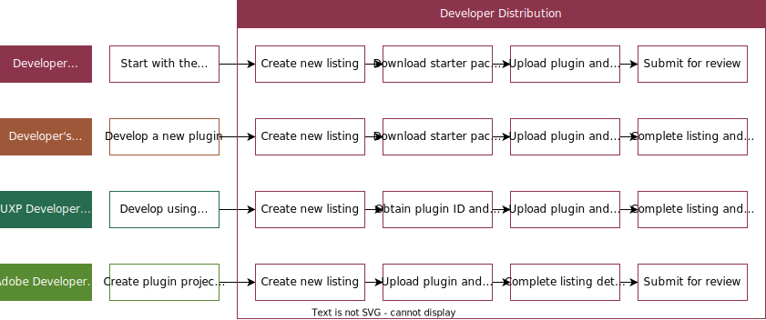

---
keywords:
  - Creative Cloud
  - Marketplace
  - Exchange
  - Distribution
  - Extensibility
  - SDK
  - Developer Tooling
  - UXP
  - Photoshop
  - XD
  - Plugin
  - JavaScript
  - Developer Console
  - Creative Cloud Desktop
  - FastSpring
title: Documentation for Adobe Developer Distribution
description: A self-service submission portal for developers to publish listings that extend Adobe products, on the Adobe marketplaces.​
---

<HeroSimple slots="heading, text" background="rgb(141, 52, 78)"/>

# Adobe Developer Distribution

A self-service submission portal for developers to publish listings that extend Adobe products, on the Adobe marketplaces.​

## Overview

[Adobe Developer Distribution](https://developer.adobe.com/distribute/home) is a new surface for developers to submit and manage their listings. The Developer Distribution surface offers a powerful and flexible approach to allow developers to create listings more rapidly, and receive approval with minimal reviewer turnaround time. This document provides guidance on how to use the Developer Distribution surface for listing submissions. Documentation will be updated as future releases support for additional Adobe products.​

## Developer Distribution New Listing Use Cases for UXP Plugin Listings​

<DetailsBlock slots="header , list" summary = "Text Description of Diagram" subText="Diagram listing common use cases:"/>

- Developer Distribution (Start with the listing metadata):

1. Create new listing
2. Download starter package with plugin ID
3. Upload plugin & enter version details
4. Submit for review.

- Developer's own sandbox (Develop new plugin):

1. Create new listing
2. download starter package with plugin ID
3. upload plugin & enter version details
4. complete listings & submit for review.

- UXP Development Tool (UDT) (Develop plugin using temporary plugin ID):

1. Create new listing
2. obtain plugin ID and add to manifest
3. upload plugin & enter version details
4. complete listing & submit for review.

- Adobe Developer Console (Create plugin project and get plugin ID):
  
1. Create new listing
2. upload plugin & enter verison details
3. complete listing details
4. submit for review

## Access the Developer Distribution Portal

For individual users who do not belong to an Adobe Enterprise or Team organization, we will automatically create your own personal Developer organization during sign-up. This is a common scenario for UXP Plugin Developers. Please see this [guide to identity types for more information](https://helpx.adobe.com/enterprise/using/identity.html).

Note that if multiple people need to manage a plugin, they will have to share the same Adobe ID credential used.

Users who already belong to an Adobe Enterprise or Team organization require either System Administrator or Developer permissions to access the Adobe Developer Console. If you are denied access to Developer Distribution when logging in with a “Company” Adobe ID, [contact your system administrator](https://helpx.adobe.com/enterprise/kb/contact-administrator.html) about getting Developer permissions assigned. More information about user management can be found in [the Adobe Admin Console guide](https://helpx.adobe.com/enterprise/using/setup-enterprise-id.html).

<DiscoverBlock slots="heading, link, text"/>

## Next Steps

[Getting started](./getting-started.md)

Get to know the key concepts around the developer distribution portal.

<DiscoverBlock slots="link, text"/>

[Get a Plugin ID](./plugin-id.md)

Learn how to get a plugin ID for your plugin.

<DiscoverBlock slots="link, text"/>

[Submission and Review](./submission/overview.md)

Learn about the submission and review process for your plugin.

