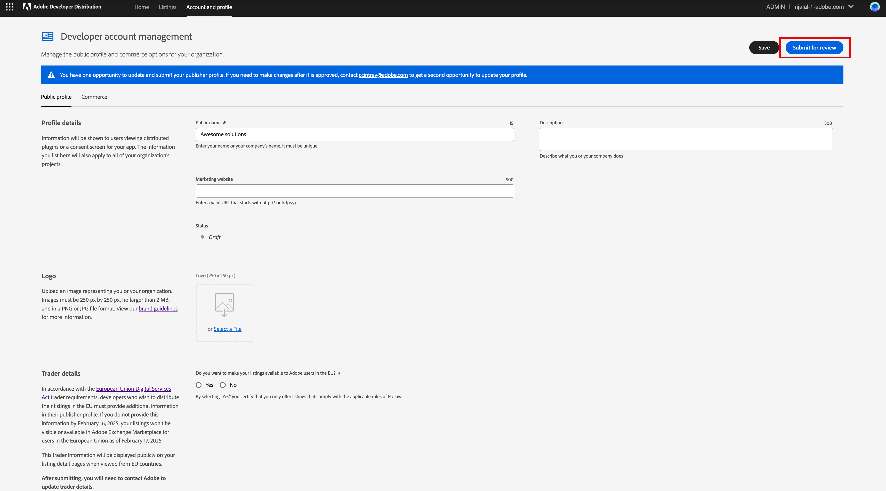

---
keywords:
  - Creative Cloud
  - Marketplace
  - Exchange
  - Distribution
  - Extensibility
  - SDK
  - DSA
  - Know your Trader
  - Developer Tooling
  - UXP
  - Photoshop
  - XD
  - Plugin
  - JavaScript
  - Developer Console
  - Creative Cloud Desktop
  - FastSpring
title: Submission and Review - Overview
description: This is the submission and review overview page
---

# Submission and Review

Congratulations! You've built a great plugin and you're ready to release it to your customers.

To publish on our Marketplaces, your plugin must first go through a review process.
By reviewing every plugin, Adobe aims to help developers get ready for prime time and ensure that users have great experiences with the plugins they consume. Our goal is to balance providing you with the best developer experience during the review process as possible, while also ensuring the approved plugins offer a great user experience for our mutual customers.

<InlineAlert slots="text" variant="info"/>

This set of guides is meant to provide you with an idea of what types of information you will need for the submission process and how to best prepare for review. Working through the guides provided in this section will help you make sure you’ve accounted for all of the requirements so you can avoid having to fix things and resubmit before being published.

## Submission Data Requirements

Below is the list of data you will be asked to provide during the submission process.

## Publisher profile

Your publisher profile is about you as a company or developer as whole. Once you've submitted this information and it has been approved by Adobe, it is shown for all plugins and integrations you publish with Adobe.

Go to **Account and profile** > **Public profile**.

Your publisher profile includes required details like:

1. Your publisher public name (often company name or, for individuals, your own name).
2. Your publisher marketing website (again, because this is part of the publisher profile, this website shows for all things you publish with Adobe and should be scoped to you as the publisher, not scoped to any single plugin or integration you submit).
3. A description of you, the publisher.
4. Your logo
5. Trader details. In accordance with the [European Union Digital Services Act](https://eur-lex.europa.eu/legal-content/EN/ALL/?uri=CELEX:32022R2065) trader requirements, developers who wish to distribute their listings in the EU must provide additional information in their publisher profile.

<InlineAlert variant="help" slots="header, text1, text2, text3, text4" />

Developer/Trader

Note that the terms **developers/traders** are used interchangeably in this guide.

Any developer who wishes to distribute their listings in the EU can be identified as a trader.

Checkout the [Adobe Know your trader](https://developer.adobe.com/compliance/) guide to understand **why and by when** you must provide these details to make your listings available in the EU.

<InlineNestedAlert variant="info" header="true" iconPosition="right">

   Are you an existing developer? Stay ahead: Update your trader details to Keep EU listings active

   Existing developers can easily update their trader details directly in their publisher profile [Adobe Developer Distribution](https://developer.adobe.com/distribute/accountProfile). 
   
   Note that only trader details can be added; other fields cannot be edited by developers. For any other changes, write to ccintrev@adobe.com.

   Failing to update these details will result in the removal of your listing from the EU region.
   
 </InlineNestedAlert>

### Trader details 🌟

Choose **Yes** if you wish to make your listings available in Adobe Exchange Marketplace for users in the European Union.

You must provide the following details:

- Business email address​
- Country code and Business telephone number
- Business street address or P.O. box
- City
- State/Province/Region
- ZIP/Postal code
- Country

You must complete and submit your publisher profile in order to submit your first plugin, however this is only a one time thing, unless you decide you need to update for your own reasons.

Click **Submit for Review** once you have added the information.

<InlineAlert variant="neutral" slots="header, text1"/>

Need any corrections in your publisher profile?

You have one opportunity to update and submit your publisher profile through [Adobe Developer Distribution](https://developer.adobe.com/distribute/accountProfile). Write to ccintrev@adobe.com to update your profile after it is approved. Any changes to your publisher profile will need to be submitted for approval again.

### Commerce

For paid plugin listings, you’ll need to register with Adobe’s third-party payment provider, [FastSpring](https://fastspring.com/sign-up/payee-adobe/), and enter your FastSpring key into your publisher profile. Please note that it may take up to 24 hours for FastSpring to create your key.

## Listing Details

Your listing metadata provides Adobe and users with details about the plugin you are currently submitting. See the [plugin version details below](#plugin-version-details) for the metadata that is submitted for each plugin version.

The information you add in the following tabs will be made public to users via Adobe's Marketplace surfaces once your listing is published.

### General Tab

- Public plugin name
- Subtitle
- Support email
- Help URL
- Description

### Localizations Tab

Localized versions of:

- Public plugin name
- Subtitle
- Description

### Media Tab

- 3 plugin icon sizes

### Tags Tab

- Categories
- Custom Tags

### Services Tab

- Privacy policy
- Terms of service
- Commerce: purchase method (paid or free)

## Plugin Version Details

Here you will provide plugin level details for each plugin version submitted.

The information you add in the following tabs will be made public to users via Adobe's Marketplace surfaces once your version is published.

### General Tab

**Note:** this tab will vary depending on plugin type being distributed, but may include:

- Plugin package file (see the [section below](#plugin-file))
- If your plugin requires another application
- If your plugin requires a 3rd party service
- Plugin UI supported languages
- Release notes

### Plugin file tab

This tab will appear specifically for ZXP plugin distribution, and is where you upload your plugin package file. **Note:** for UXP plugins, the file is uploaded in the 'General' tab.

### Localizations Tab

Localized versions of:

- Release notes

### Media Tab

- Screenshots
- Videos

## Plugin file

As part of your submission, you will upload your plugin package. Take the following steps to create your plugin package, categorized by plugin type.

### UXP plugin package

1. Compress your plugin files as a **.zip** file

   - Select all files within your plugin's parent folder. On both macOS and Windows you can right-click to compress:

     **macOS**:
     Right-click > Compress items

     **Windows**:
     Right-click > Send to > Compressed (zipped) folder

     **Note:** You should _not_ compress the plugin's parent folder. Instead, compress the contents of the parent folder. Failure to do so will likely cause a rejection when submitting.

2. Rename the **.zip** extension to **.xdx** or **.ccx** depending on the target host app.

   - Adobe XD recognizes the **.xdx** file extension as an **XD** plugin and Photoshop recognizes the **.ccx** as a **Photoshop** plugin.

   - By using this file extension, your plugin automatically gets the "double-click to install" feature, meaning that if you share your plugin directly to users, all they have to do is double-click to install the plugin.

3. Verify the packaging worked:

   - Double-click your final plugin package file. When your OS prompts you to install the plugin, click "Install".

   - Verify you see a success message upon installation and your plugin available in the host app.

For more information on how to package your UXP plugins, please refer to these additional resources ([Photoshop](https://developer.adobe.com/photoshop/uxp/2022/guides/distribution/packaging-your-plugin/), [XD](https://developer.adobe.com/xd/uxp/distribution/packaging-your-plugin/)).

### ZXP plugin package

<h3>1. .zxp (CEP/MXI):</h3>

- **CEP**: CEP (Common Extensibility Platform) lets you build extensions in Adobe Creative Cloud applications like Photoshop, Illustrator, InDesign, After Effects, and many more. Extensions built with CEP let users customize their Creative Cloud experience for their unique workflows. To create package for a CEP extension:  

   1. Create a folder with the desired name of the `.zxp` package you want to upload

   2. Add a folder called CSXS, that should contain the manifest.xml file. This file is the manifest file and has details such as products and platforms supported  

   3. Add an extension-panel HTML file and any dependent files

   4. Add any other optional resources used by the extension, such as icons and localization files

   5. For a hybrid extension, the folder must include the resource files for the native plugin or scripting component

   6. A file named `mimetype` will be generated by the signing process, which is detailed in the next step 'Signing and packaging for CEP/MXI'.

   For more information, refer to [this guide](https://github.com/Adobe-CEP/Getting-Started-guides/tree/master/Package%20Distribute%20Install) for packaging and signing your CEP plugins.

- **MXI:** MXI packaging is used to have more generically formed packages. With an MXI, you can not only include multiple ZXP containing any extensions, but you can also include files to be placed anywhere on the user’s system. To create a package:

   1. Add manifest details such as a unique bundle id and versions for Adobe products that your app supports in a `.mxi` file  

   2. The `.mxi` file should have the name that matches the bundle id of your extension

   A file named `mimetype` will be generated by the signing process, which is detailed in the next step 'Signing and packaging for CEP/MXI'.  

- **Signing and packaging for CEP/MXI:** Adobe provides a command-line tool, `ZXPSignCmd`, that can be used to package and sign extensions. Use [this guide](./packaging_signing.pdf) as a reference on packaging and signing.

<h3>2. Others (not CEP/MXI):</h3>

All non-zxp files (e.g. image, pdf etc.) need to be submitted in a `.zip` folder

On successful package upload, you’ll be asked on Developer Distribution for versions of Adobe products that your app supports, platform/s, and version number for your app. On successfully saving this information, a manifest file will be generated with unique bundle id for your app.
