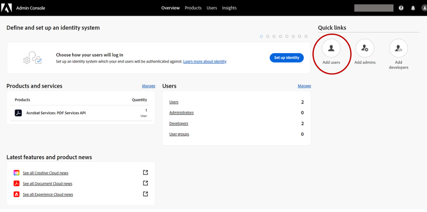
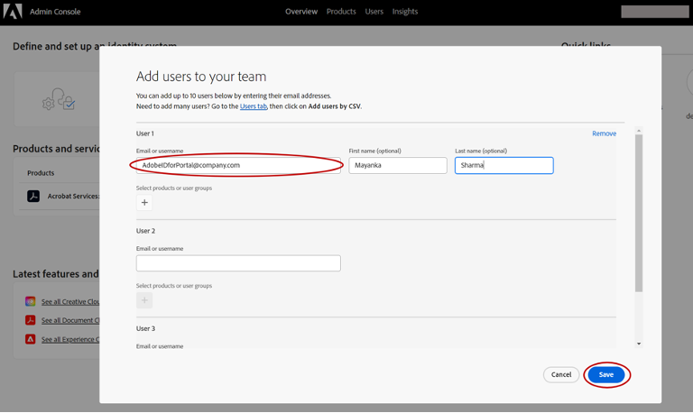
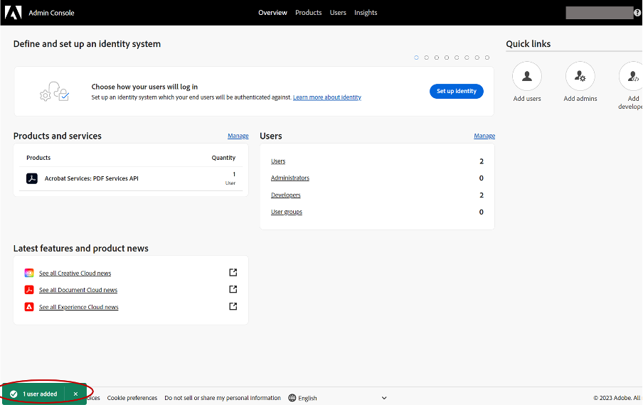
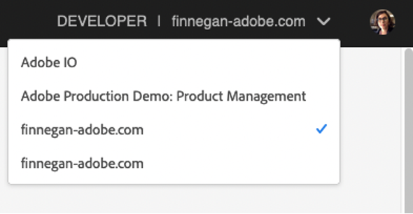

---
keywords:
  - Creative Cloud
  - Marketplace
  - Exchange
  - Distribution
  - Extensibility
  - SDK
  - Developer Tooling
  - CEP
  - ZXP
  - Photoshop
  - XD
  - Plugin
  - JavaScript
  - Developer Console
  - Creative Cloud Desktop
  - FastSpring
title: ZXP Distribution
description: Important updates for ZXP and distribution.
---

<HeroSimple slots="heading,text" background="rgb(141, 52, 78)"/>

# Important Changes in ZXP Distribution
The Creative Cloud Exchange Partner Portal has been merged into Adobe Developer Distribution.

Developer Distribution is a unified portal where you can submit and manage your ZXP and UXP plugin listings. Click **Distribute** in the top right, to begin creating your ZXP listings from Developer Distribution, or manage your existing ones. ​

<Announcement slots="buttons" position="center" />

- [Launch Developer Distribution](https://developer.adobe.com/distribute/home)

## Frequently Asked Questions
- [Important Changes in ZXP Distribution](#important-changes-in-zxp-distribution)
  - [Frequently Asked Questions](#frequently-asked-questions)
  - [Answers](#answers)
    - [What is Developer Distribution?](#what-is-developer-distribution)
    - [Why can't I upload a plugin package larger than 300 MB?](#why-cant-i-upload-a-plugin-package-larger-than-300-mb)
    - [Why can't I see my CEP Listings?](#why-cant-i-see-my-cep-listings)
    - [How can I be added to a developer org?](#how-can-i-be-added-to-a-developer-org)
    - [How can I find out who from my team is the admin of the developer org created for my organization? ](#how-can-i-find-out-who-from-my-team-is-the-admin-of-the-developer-org-created-for-my-organization)
    - [I have an account that I use to log into Developer Distribution to manage my UXP plugin listings, and another one that I use to log into Creative Cloud Exchange Partner Portal to manage my ZXP/CEP plugins listings. Will these accounts be automatically merged when Partner Portal workflows move to Developer Distribution, or do I need to do something?](#i-have-an-account-that-i-use-to-log-into-developer-distribution-to-manage-my-uxp-plugin-listings-and-another-one-that-i-use-to-log-into-creative-cloud-exchange-partner-portal-to-manage-my-zxpcep-plugins-listings-will-these-accounts-be-automatically-merged-when-partner-portal-workflows-move-to-developer-distribution-or-do-i-need-to-do-something)
    - [What’s involved in merging accounts?](#whats-involved-in-merging-accounts)
      - [Background:](#background)
      - [Developer Account Merge](#developer-account-merge)
    - [What if I only have one account on the Developer Distribution portal?](#what-if-i-only-have-one-account-on-the-developer-distribution-portal)
    - [What if I only have one account on the Exchange Partner Portal?](#what-if-i-only-have-one-account-on-the-exchange-partner-portal)
    - [Will this change impact how my CEP listings show up in the Adobe Exchange or in Creative Cloud Desktop plugin marketplaces?](#will-this-change-impact-how-my-cep-listings-show-up-in-the-adobe-exchange-or-in-creative-cloud-desktop-plugin-marketplaces)

## Answers

### What is Developer Distribution?
Developer Distribution is a unified portal where you will be able to submit your CEP and UXP plugin listings, and manage them. Read [this announcement blog post](https://blog.developer.adobe.com/introducing-a-new-developer-distribution-portal-for-listing-uxp-plugins-in-the-creative-cloud-7f81376f46a9) to learn more. Also, check out the [frequently asked questions](../faq.md) about Developer Distribution.

### Why can't I upload a plugin package larger than 300 MB? 
Currently the new Developer Distribution portal has maximum upload of 300 MB for ZXP plugin packages. This FAQ will be updated when it's possible to upload larger packages. If you have any questions, please [write to us](mailto:ccintrev@adobe.com).  
 
### Why can't I see my CEP Listings?
If you had multiple users that could access your ZXP listings in the Creative Cloud Adobe Exchange Portal, someone from your team was the primary contact for that account. That person will be assigned as the administrator of a newly created developer organization with all ZXP existing listings assigned to that developer org. Please ask that person to log in to [Adobe Admin Console](https://adminconsole.adobe.com/) to assign your Adobe ID in the same org and your access will be restored. Now ZXP and UXP developers can use a single org (with multiple users) to manage all their plugins and they will appear together under one publisher profile on Adobe Exchange.  ​ 

### How can I be added to a developer org? 
Please ask the admin of your developer org to take following steps to add you to the org:  

1. Log into [Adobe Admin Console](https://adminconsole.adobe.com/)  with the same Adobe ID that they used to login to Developer Distribution.

2. Click on **Add users** under "Quick links" on the top right of the Adobe Admin Console’s home screen:

3.	A popup titled **Add users to your team** will appear. Under User 1, add your Adobe ID that you had used to login to Creative Cloud Adobe Exchange Partner Portal. Add your first and last name and hit **Save**.

4.	A success toast will appear to confirm that you have been successfully added to the developer org. You should also receive a confirmation email. 

5.	You should now be able to login to Developer Distribution and see all the ZXP plugin listings and be able to manage them. If you are still unable to access your existing listings in Developer Distribution, please write to us.   

### How can I find out who from my team is the admin of the developer org created for my organization?  
The person who is the primary contact for your account on the Exchange Partner Portal will be the admin of the developer org. If you are not sure who that might be, please [write to us](mailto:ccintrev@adobe.com).
  
### I have an account that I use to log into Developer Distribution to manage my UXP plugin listings, and another one that I use to log into Creative Cloud Exchange Partner Portal to manage my ZXP/CEP plugins listings. Will these accounts be automatically merged when Partner Portal workflows move to Developer Distribution, or do I need to do something?

All developers who have multiple accounts should [fill out this form](https://survey.adobe.com/jfe/form/SV_2osb09BHSXILQ6q). If you use two different email addresses and we do not receive any feedback from you, your UXP and ZXP/CEP listings will continue to be grouped under two different email addresses and you will have two different public profiles in the new Developer Distribution portal.

If you use the same email address, and you publish your UXP and ZXP/CEP listings under the same name today, we will merge your accounts into one public profile in the new Developer Distribution portal even if we don't hear back from you. 

You can read more about the details in the [recently published blog post](https://blog.developer.adobe.com/request-for-information-plugin-developers-please-help-us-merge-your-accounts-edfd2d408615). If you have any questions or concerns, please [reach out to us](mailto:ccintrev@adobe.com).  

### What’s involved in merging accounts?
#### Background: 
-	All UXP developers log in with Adobe ID credentials to an account that is associated with a developer organization, which you can see in the upper right org switcher when logged into [Developer Distribution](https://developer.adobe.com/distribute/home) or the [Developer Console](https://developer.adobe.com/console/):

-	ZXP/CEP developer's accounts on the Exchange partner portal do not have a developer org associated with them.

#### Developer Account Merge 
- As part of the migration of all listings from the Exchange Partner Portal to Developer Distribution, for Developers with two accounts, we will assign their Developer Distribution accounts to their newly migrated ZXP/CEP listings. 
- Once all of the (UXP, ZXP/CEP) listings are assigned under the same account, developers will be able to manage all their listings from Developer Distribution.

### What if I only have one account on the Developer Distribution portal?
If you have built and listed only UXP plugins on Developer Distribution, then you already have a developer organization, and you don't need to take any action. 

### What if I only have one account on the Exchange Partner Portal?
If you have only built ZXP/CEP plugins in the past and are used to logging into Exchange Partner Portal, then all your listings will be migrated as is to your new Developer Distribution portal account. Please be assured that **you will not lose anything, and we will ensure that your listings details, uploaded packages, and ratings and reviews will be carried over to the new Developer Distribution portal**. This migration is tentatively scheduled for late June, but the timeframe could shift.

### Will this change impact how my CEP listings show up in the Adobe Exchange or in Creative Cloud Desktop plugin marketplaces?
There is no impact on how users discover, acquire or install your listings on Adobe Exchange or Creative Cloud Desktop plugin marketplaces.
