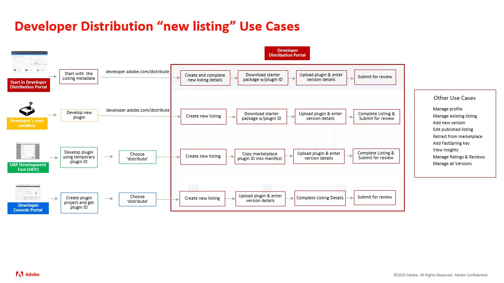

<Hero slots="heading, text" background="rgb(141, 52, 78)" hideBreadcrumbNav={false} width="100%"/>

<!--  -->

# Adobe Developer Distribution

A self-service submission portal for Creative Cloud UXP plugin developers to publish listings for their plugins on the Adobe Exchange and Creative Cloud marketplaces.

## Overview

[Adobe Developer Distribution](/distribute/home) is a portal with the sole purpose of distributing plugins. Previously, developers used the [Adobe Developer Console](/developer-console) to associate a project with a plugin ID for distributing their UXP plugins. The new [Adobe Developer Distribution](/distribute/home) allows developers to skip the step of visiting the Adobe Developer Console and instead provides a one-stop place to do everything needed for distributing their UXP plugins. This documentation provides guidance on how to use the new portal and details on all of the new developer features it unlocks. Future releases of the portal will support ZXP plugins, additional UXP plugins for more Creative Cloud apps and 3rd party integration for other Clouds.

**Note:** Developers can still choose to start in the Adobe Developer Console to create or manage a listing for their plugins if desired, but they will now simply be routed to the [Adobe Developer Distribution portal](/distribute/home) to complete the rest of the steps.

## How to Use

## How to Access

For individual users who do not belong to an Adobe enterprise or team organization, we will automatically create your own personal Developer organization during sign-up. This is the most common scenario for UXP Plugin Developers. Note that if multiple people need to manage a plugin, they will have to share the same Adobe ID credential used.

Users who already belong to an Adobe enterprise or team organization require either System Administrator or Developer permissions to access the Adobe Developer Console. If you are denied access to Developer Distribution when logging in with a “Company” adobe ID, contact your system administrator about getting Developer permissions assigned. More information about user management can be found in the Adobe Admin Console guide.

 
